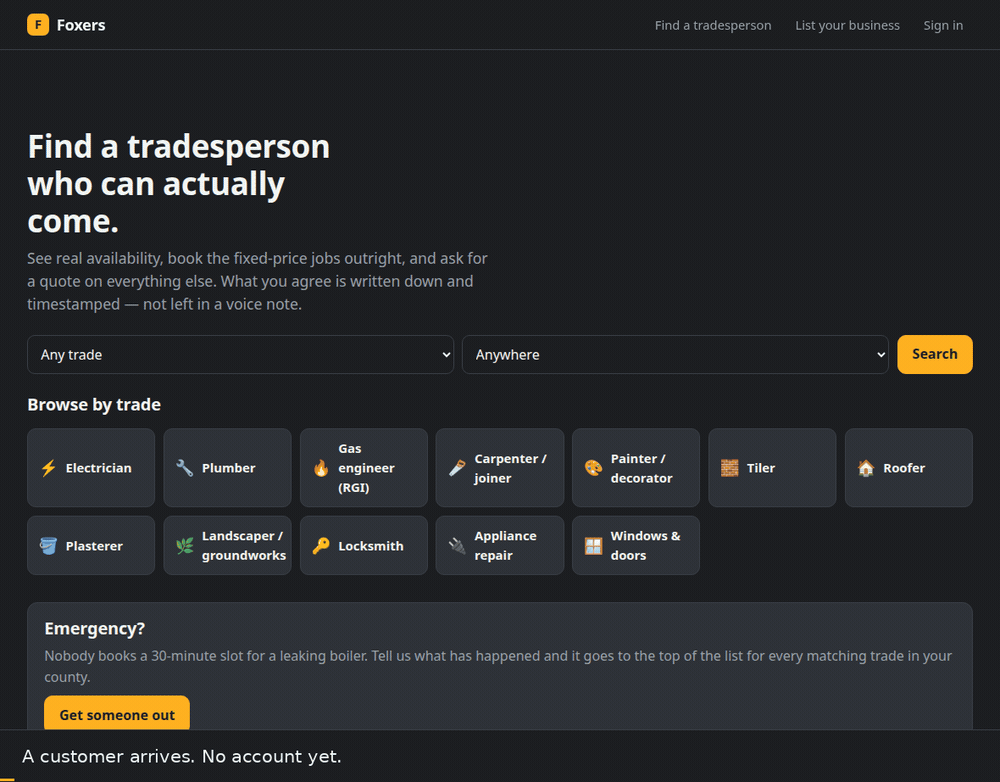

# Foxxers

Job software and a booking marketplace for trades, for Ireland and the UK.

Two apps share one domain, and the split between them is the product. A **customer**
signs in, searches by trade and county, and either books fixed-price work outright or
describes a job and gets a written quote. A **foxxer** — the tradesperson — signs in to a
console: requests to price, quotes waiting on a yes, the diary, and the money.

Node standard library only. No npm, no build step, no outbound calls.



*A real run, not a mockup: a customer searches, signs in, opens a quote and picks one
of three hours the electrician actually has free — accepting is the booking — and it is
already in his diary when he opens it.*

---

## Why this can be a booking app at all

Most trade work cannot be booked. You cannot put a price on "the board keeps tripping"
without looking at it, and every attempt to make trades work like haircuts founders on
that.

But a real subset of it *can*, and that subset is bigger than it first looks: a boiler
service, an EICR, a gutter clean, a lock change, an EV charger survey. Known duration,
known price. `server/lib/trades.js` carries that split for twelve trades — a `bookable`
list and a `quoteOnly` list each. A foxxer publishes whichever they actually offer.

**Fixed scope is bookable. Everything else routes to a quote.** That one line is the
product; the rest of this repo is the consequences of it.

---

## Running it

```sh
git clone https://github.com/brianm2712/foxxers && cd foxxers

rm -rf data && FOXXERS_DATA=./data node scripts/seed.js
FOXXERS_DATA=./data FOXXERS_PORT=8120 node server/index.js
```

Then open <http://localhost:8120>. Password for every seeded account is
`foxxers-demo-2026`.

| Sign in as | Email | What it shows |
|---|---|---|
| Customer | `ciara@example.com` | Five jobs: one waiting on her answer, one paid with a receipt, one declined, one still being priced |
| Foxxer (IE) | `byrne.electrical@example.com` | RCT 20%, an overdue invoice with a chase queued, a deposit earned |
| Foxxer (UK) | `mcallister.electrical.ni@example.com` | The UK side — VAT 20% and CIS instead of RCT |

The foxxer sign-in page lists the demo logins, but only when the hostname is localhost.

> **Stop the server before reseeding.** It holds the whole database in memory and
> flushes on write, so `rm -rf data && node scripts/seed.js` against a running server
> gets silently clobbered when that process next saves.

### Tests

```sh
node tests/api.test.js       # 42 — end-to-end over real HTTP
node tests/connect.test.js   # 21 — Stripe Connect onboarding and invoice payment
node tests/revolut.test.js   #  8 — the Revolut adapter against a strict mock
node tests/webhook.test.js   #  5 — webhook signatures, on a real server
node tests/schedule.test.js  #  7 — slot generation, DST, busy-time subtraction
node tests/tax.test.js       #  9 — VAT, RCT, CIS, reverse charge, invoice numbering
```

`api.test.js` spawns a real server on a throwaway data directory and drives it the way
the iOS client will: bearer token, JSON in, JSON out.

### On a Linux desktop

```sh
./scripts/install-desktop.sh
```

Puts Foxxers in the applications menu and on the desktop with the fox icon.
Launching it starts the server if it is not already running — seeding first if
there is no database yet — waits for it to answer, then opens the browser. If
it cannot start, it says so in a dialog rather than doing nothing. Everything
lands under `$HOME`; nothing needs root.

### Environment

| Variable | Default | Purpose |
|---|---|---|
| `FOXXERS_DATA` | `./data` | Where the JSON database and session key live |
| `FOXXERS_PORT` / `FOXXERS_HOST` | `8120` / `127.0.0.1` | Bind address |
| `FOXXERS_OPEN_SIGNUP` | on | Set to `0` to close foxxer signup |
| `FOXXERS_SEED_PASSWORD` | `foxxers-demo-2026` | Password for seeded accounts |
| `FOXXERS_LIMIT_LOGIN` \| `SIGNUP` \| `WRITE` \| `READ` | `8` \| `10` \| `30` \| `600` | Rate-limit ceilings, so tests can raise them without the code knowing it is being tested |

---

## Layout

```
server/index.js         one HTTP server, one router, every route
server/lib/domain.js    the business operations — everything that changes state
server/lib/tax.js       IE and UK construction tax. Rates are data, not literals
server/lib/payments.js  deposits, taking money, and the provider seam
server/lib/providers/   payment rails — the only code here that talks to the internet
server/lib/schedule.js  availability → bookable slots, DST-correct
server/lib/trades.js    the trade taxonomy: what is bookable, what can only be quoted
server/lib/store.js     append-and-flush JSON store
server/lib/auth.js      scrypt, signed session and job tokens, rate limiting
server/lib/http.js      request/response plumbing, static files, cookies

web/public/js/app.js       router and shell — the two front doors
web/public/js/customer.js  everything a customer sees
web/public/js/pro.js       everything a foxxer sees
web/public/js/api.js       the only place that talks to the server
web/public/js/ui.js        DOM and money-formatting helpers

scripts/seed.js         demo data — a marketplace worth looking at
scripts/foxxers          start it if it is not running, then open it
scripts/install-desktop.sh  applications-menu and desktop launcher, with the icon
scripts/make-icons.py   app icons from the artwork (dev only, needs Pillow)
tests/                  six suites, 92 assertions
```

`data/` is gitignored. It holds every password hash and the key that signs every
session and job token.

---

## The job lifecycle

Two doors into the same set of records.

```
BOOK   (fixed scope)     confirmed → scheduled → done → invoiced → paid
ASK    (unknown scope)   open → quoted → accepted → done → invoiced → paid
```

The **accept** step is timestamped and immutable. It is the record of what was agreed,
which is the thing a WhatsApp voice note never produces.

### Asking, in full

1. **The customer sends a request, and €5 is HELD on their card.** Not taken — held, and
   not to accept but to ask.
2. **The foxxer prices it and offers up to three genuinely free hours**, checked against
   their real availability at the moment of sending.
3. **The customer accepts one of those hours.** Accepting *is* the booking: it lands in
   the diary at that instant, and that hour immediately stops being offerable to anyone
   else. A price agreed without a date is the failure this app exists to prevent.
   - **Declined instead?** The hold is captured and transferred to the foxxer, for
     pricing a job that went nowhere.
   - **Accepted?** The hold is cancelled. Nothing is ever charged, the invoice is for
     the quoted price with no €5 line on it, and a genuine customer pays no fee for the
     privilege of having asked.
4. **The job is done, and the balance is taken at the door** — card reader, Apple or
   Google Pay, Revolut, transfer or cash.
5. **The receipt is issued in the same request as the payment**, because they are one
   event: the customer wants it before the van has pulled away.

---

## Money and tax

Construction tax lives in `server/lib/tax.js` with its own test suite, rather than being
sprinkled through the invoice renderer. Rates are data, so a budget change is an edit to
one table.

- **Ireland** — VAT at 13.5% (most construction services), 23%, 9%, zero and exempt.
  **RCT** withheld by the principal contractor at 0/20/35% of the **whole net**.
- **UK** — VAT at 20% and 5%. **CIS** at 0/20/30%, deducted from the **labour element
  only**; materials are excluded.
- **Reverse charge** zeroes the VAT charged but still reports what it would have been.

Three things that are easy to get backwards, and are tested because of it:

- **VAT is computed per line at that line's own rate**, on the net.
- **Withholding is computed on the net, never on the VAT.**
- **A deposit is never a discount.** On the current rule the €5 is released rather than
  charged, so the invoice is for the full price and there is nothing to credit. Deposits
  taken under the older charge-then-credit rule still settle as money on account: VAT is
  charged on the full price and the €5 only reduces what is left to collect. Treating it
  as a discount either way would understate the VAT on every job that began as a request.

Invoice numbers are sequential per foxxer with no gaps, and the counter advances at issue
and never at draft — a number derived from a timestamp is not a sequence, and neither is
one that skips when a draft is deleted.

**None of this is tax advice.** The rates are the published ones as of 2026-09 and an
accountant signs them off before a real invoice goes out.

### Chasing

An overdue invoice queues a message, written for the foxxer to send on WhatsApp: three
days before due, then at 1, 7, 14 and 30 days past. Only **the stage actually reached**
is offered — an invoice ten days late must not offer "due in three days" alongside two
later messages. Sending stays the foxxer's decision, because the customer is often
someone they will meet again.

---

## Payments

`server/lib/payments.js` defines the contract; a provider is four methods. Three exist.

**`manual` is the default.** It records what *would* have happened and sets
`moved: false`, and the UI says so plainly on the deposit card and on the receipt. No
card is charged. Every state transition, amount and receipt is still real and stored,
so the whole flow can be exercised without a payment account.

**`revolut` is a real rail.** Set it up with:

```sh
FOXXERS_PAYMENTS=revolut
FOXXERS_REVOLUT_SECRET_KEY=sk_...          # Merchant API secret key
FOXXERS_REVOLUT_WEBHOOK_SECRET=wh_...      # signing secret for the webhook
FOXXERS_PUBLIC_URL=https://foxxers.com     # where customers come back to
FOXXERS_REVOLUT_LIVE=1                     # omit entirely to stay on sandbox
```

Point the Revolut webhook at `POST /api/v1/webhooks/revolut`.

> **It has never made a request to Revolut.** It is written to the documented shape of
> the Merchant API and tested against a mock that refuses what the real one refuses, but
> no credentials exist on this machine. Run it against the sandbox before it sees a real
> card. The API version is pinned in `revolut.js` — the Merchant API is versioned by
> date and changes shape across versions.

### A real rail is not synchronous, and that changes the flow

`manual` pretends money moves the instant a form is submitted. Revolut does not: you
create an order, the customer pays on Revolut's page, and you find out from a webhook.
So a deposit starts `pending` with a checkout URL and only becomes `held` when Revolut
says so — **a customer landing back on a success page is not evidence that anything was
paid**, and nothing in the browser can move a payment.

A deposit's life is a transition table, which is what stops it being both credited to an
invoice and pocketed by the foxxer:

```
pending → held       the customer actually paid
        → failed     they did not
held    → released   quote accepted; the hold is cancelled, nothing is charged
held    → credited   the older rule: the €5 was taken and comes off the invoice
held    → expired    nobody answered inside the week a card hold lasts
        → captured   quote declined; the foxxer keeps it
        → refunded   nobody quoted, so nobody earned it
```

Money crosses to Revolut in **integer minor units** — €5.00 goes over the wire as 500 —
and every crossing goes through `toMinor`/`fromMinor`. Getting that wrong by a factor of
a hundred is the quiet way to lose a lot of money.

Adding another rail (**SumUp** for the RFID reader) is one more file in
`server/lib/providers/` with the same four methods. Nothing above `payments.js`
changes.

### `stripe` — the marketplace rail, and where customer money is meant to go

Revolut is single-merchant: every customer payment lands in one account, which for a
marketplace means the platform holding money it owes to tradespeople — in the EU,
regulated activity under PSD2. **Stripe Connect** gives each foxxer their own account,
so funds settle to them and the platform takes a stated fee without ever holding
anything. `docs/stripe-connect-plan.md` has the full scope.

**Phases 1 and 2 are built.** A foxxer gets a connected account and the app learns
whether they can be paid; an invoice can then be taken by card as a destination charge.

Connected accounts use the **Accounts v2 API** (`/v2/core/accounts`), not the legacy
`type: 'express'` shorthand. Instead of an opaque account type, the responsibilities are
stated: the platform collects fees and carries losses, the foxxer gets an Express-style
Stripe dashboard, and two configurations are requested — `merchant` so an invoice can be
charged to them, `recipient` so a captured deposit can be transferred to them. v2 speaks
JSON where v1 speaks form encoding, and returns `null` for anything not named in
`include`; `stripe.js` handles both and always asks.

```sh
FOXXERS_PAYMENTS=stripe
FOXXERS_STRIPE_SECRET_KEY=sk_test_...       # sk_live_ switches it to live, nothing else to set
FOXXERS_STRIPE_WEBHOOK_SECRET=whsec_...     # signing secret for the webhook
FOXXERS_PUBLIC_URL=https://foxxers.com      # where Stripe returns them to
FOXXERS_PLATFORM_FEE_BPS=200                # the platform's cut, 2% by default
FOXXERS_PLATFORM_FEE_CENTS=0
FOXXERS_HOLD_DAYS=7                         # how long a deposit hold lives before the
                                            # request expires with it
```

Point the Stripe webhook at `POST /api/v1/webhooks/stripe`.

**Which events actually arrive is not what the v2 documentation suggests.** A v2 account
emits thin `v2.core.account[…]` events, but those go to a separately configured event
destination — a classic webhook endpoint receives the **v1 connect events**
(`account.updated`, `capability.updated`, `person.*`) even for a v2 account. This was
found by pointing the Stripe CLI at a running server and reading what turned up. The
handler takes both families and treats them identically: neither is parsed for state, it
just re-reads the account, so there is no payload to trust and no second code path.

### Taking an invoice

**A card payment is a link, not a form.** The foxxer picks *Card payment link*, the app
creates a Stripe-hosted Checkout Session as a **destination charge** to their connected
account, and hands back a link to send. Nothing on a Foxxers page loads from Stripe.

**The invoice stays owed until Stripe says otherwise.** No receipt is written when the
link is created — a receipt is proof of payment, and issuing one for money that has not
arrived is the one lie this app cannot tell. `checkout.session.completed` marks it paid
and issues the receipt, and is idempotent because webhooks are redelivered.

**Cash and bank transfer never touch Stripe.** They moved outside the app, so they are
recorded, not charged; routing them to a card rail would invent a fee and a charge that
never happened. A rail declares what it can take (`handles` on the provider) and
everything else falls back to recording.

**The amount charged is what is payable**, which on an RCT job is net + VAT *less* the
20% withheld at source. Billing the pre-withholding figure would overcharge the customer
by exactly what somebody else remits to Revenue on their behalf.

**Being able to take a card is not the same as being able to receive it.** A destination
charge needs both the `merchant` card-payments capability and the `recipient` transfers
one; real Stripe refuses with `insufficient_capabilities_for_transfer` when the second is
missing, so the app checks both before offering to take anything.

**A foxxer who has not onboarded is not hidden and not blocked.** They appear in search,
take requests and quote like anyone else — they simply cannot be paid *through the app*
yet, and the Business tab says so in amber rather than red. Putting ID and a bank
account between signing up and getting any value is how a marketplace never reaches its
first hundred trades. Cash, transfer and their own card reader are unaffected.

> **Onboarding has been run against real Stripe; the money paths have not.** A real
> connected account was created through the app in a sandbox, a real hosted-onboarding
> link opened, real requirements were parsed, and a real connect event was received and
> acted on. Nothing in Phases 2–4 — charging an invoice, holding or capturing a deposit —
> has been exercised against Stripe at all. The API version is pinned in `stripe.js` and
> is not optional: the v2 endpoints reject older versions outright.

---

## Who is signed in

Both sides sign in with an email and a password (scrypt). Sessions are signed tokens
carrying a `kind`, so a customer token can never be presented as a foxxer one — the kind
is inside the signature, and flipping it invalidates it.

**A browser can hold both sessions at once.** A tradesperson books a plumber like anyone
else, so the two live in separate cookies (`fx_session`, `fx_customer`) and separate
storage keys. `web/public/js/api.js` picks the right token by URL prefix, so no route can
accidentally be called with the wrong identity.

**Job tokens survive alongside all this.** A foxxer quoting a walk-in has nobody to attach
an account to, and the link they hand over still has to open, so a signed per-job token
remains a credential in its own right — bound to exactly one reference, checked in
constant time. A customer's own job list hands out those same tokens, so it is one page
with one access check whether it was reached from the list or from a link.

An account is only ever joined by signing into it. A walk-in a foxxer writes up is never
merged into one on a matching phone number — a shared landline or a mistyped digit would
otherwise drop a stranger's job into someone's job list.

---

## The API

The contract between the server and every client. Nothing renders HTML on the server, so
each screen on each platform is built from these routes.

**Public**

| | |
|---|---|
| `GET /api/v1/meta` | Trades, counties, urgency levels, VAT classes, withholding rates, deposit amounts, payment methods |
| `GET /api/v1/pros` | Search. `?trade=&area=&q=&emergency=1` |
| `GET /api/v1/pros/:slug` | Profile, services, reviews, rating |
| `GET /api/v1/pros/:slug/slots` | Bookable slots. `?serviceId=&days=` |
| `GET /api/v1/health` | |

**Customer account**

| | |
|---|---|
| `POST /api/v1/auth/customer/signup` `/login` `/logout` | |
| `GET` `PUT /api/v1/me` | Their details |
| `GET /api/v1/me/jobs` | Their jobs, each carrying the token its page opens with |
| `POST /api/v1/bookings` | Book a slot. Requires a session |
| `POST /api/v1/requests` | Describe a job; takes the deposit. Requires a session |

**A job, by reference and token** — `?t=<job token>`

| | |
|---|---|
| `GET /api/v1/jobs/:ref` | The whole job: quotes, invoices, deposit, receipt |
| `POST /api/v1/jobs/:ref/accept` | `{ quoteId, start }` — accepting books that hour |
| `POST /api/v1/jobs/:ref/decline` | The foxxer keeps the deposit |
| `POST /api/v1/jobs/:ref/review` | Only a job that was actually carried out |

**Foxxer console** — bearer token or `fx_session` cookie

| | |
|---|---|
| `POST /api/v1/auth/signup` `/login` `/logout`, `GET /api/v1/auth/me` | |
| `GET /api/v1/pro/dashboard` | Money, counts, what is coming up, chases due |
| `GET /api/v1/pro/requests` | Aimed at them, plus open ones matching trade **and** area |
| `GET /api/v1/pro/bookings`, `PATCH /api/v1/pro/bookings/:id` | The diary |
| `GET /api/v1/pro/slots` | Their own free hours, for offering on a quote |
| `GET` `POST /api/v1/pro/services`, `PATCH` `DELETE …/:id` | Retiring, never deleting — past bookings point at these |
| `GET` `PUT /api/v1/pro/availability` | The working week and the rules around it |
| `GET` `POST /api/v1/pro/quotes` | |
| `POST /api/v1/pro/price` | Price lines without saving — the builder recalculates as you type |
| `GET` `POST /api/v1/pro/invoices` | |
| `POST /api/v1/pro/invoices/:id/paid` | `{ method }` — takes the money and returns the receipt |
| `GET /api/v1/pro/deposits` | Earned from declined quotes, credited to jobs that went ahead |
| `GET /api/v1/pro/chases`, `POST /api/v1/pro/chases/:invoiceId` | |
| `PUT /api/v1/pro/profile` | |
| `GET /api/v1/pro/payouts` | Whether Stripe can pay them yet, and what it is still waiting on |
| `POST /api/v1/pro/payouts/onboard` | A Stripe onboarding link. Creates the account the first time, never twice. Refused until the agreement is accepted |
| `GET /api/v1/pro/agreement` | The platform agreement, its version, and whether they have accepted it |
| `POST /api/v1/pro/agreement/accept` | Accept it, against the version that was shown |

---

## Constraints worth keeping

- **Node standard library only.** No npm, no build step, no lockfile, no supply chain.
  The single exception is `scripts/make-icons.py`, which regenerates the app icons
  from the artwork and runs on a workstation, never at runtime.
- **One place talks to the internet.** `server/lib/providers/revolut.js`, and only when
  `FOXXERS_PAYMENTS=revolut`. Everything else — the whole app on the default settings —
  makes no outbound request at all.
- **No tracking, no analytics, no third-party requests** on the web client. No web fonts
  are fetched.
- **One implementation of the arithmetic.** The quote builder prices on the server on
  every keystroke rather than doing the sums in the browser. A customer and a foxxer
  looking at different totals is the one bug this app cannot afford.
- **Ranking is explainable.** Search puts whoever can start soonest above whoever has a
  better star average, because "when can you come" is the question customers are really
  asking. Every marketplace that inverts this ends up selling placement instead.

## Not built yet

- **The iOS and iPadOS clients.** `ios/` is empty. The API above is the contract they are
  meant to be built against, and `web/public/js/api.js` is the file to mirror.
- **A verified payment path.** Stripe onboarding has had a real round trip; no charge,
  deposit, capture or transfer has. They are exercised only against a mock that refuses
  what the real one refuses, which is not the same thing — run `scripts/stripe-check.js`
  against a test key to change that. The Revolut adapter has never spoken to Revolut.
- **Stripe Connect phase 4, going live.** Onboarding, invoice payments, deposits, the
  platform agreement and fee disclosure are built. What is left needs the Stripe
  dashboard and a test key: the platform profile and branding, and a test-mode run of
  every money path — `scripts/stripe-check.js` runs that check and refuses a live key.
  Step by step in `docs/go-live.md`; the five decisions that shaped the rest are in
  `docs/stripe-connect-plan.md`.
- **A reviewed platform agreement.** `server/lib/agreement.js` states plainly what the
  code does with a foxxer's money and is wired into onboarding, but it has not been near
  a solicitor. Do not let a real tradesperson accept it as it stands.
- **Photos on a request.** The field exists and is always empty.
- **Refunding a deposit on a request nobody ever quoted.** The state and the transition
  exist; nothing schedules it.
